# Caleido

**A production-grade scheduling platform inspired by Calendly, built with Django REST Framework.**


**Repo:** [github.com/Harbdulmarleyk03/Caleido](https://github.com/Harbdulmarleyk03/Caleido) · **API Docs:** `/api/docs/` (Swagger) · `/api/redoc/` (ReDoc) · `/api/schema/` (OpenAPI 3.1)

---

## 🚀 Highlights

- Race-condition-safe booking creation (`SELECT FOR UPDATE` + idempotency keys) — verified under real concurrent threads
- Pure-Python, DST-safe slot engine with zero ORM calls — fully unit-testable in isolation
- Async email + ETA-scheduled reminders via Celery, auto-revoked/rescheduled on cancel/reschedule
- Redis-backed caching and idempotency store, invalidated by signals — not left to expire stale
- 182+ tests, ≥80% coverage gate enforced in CI
- Dockerized (multi-stage, non-root), full GitHub Actions pipeline: lint → format → test → coverage → build

---

## 📖 Overview

Caleido lets a host define availability, publish bookable event types, and let invitees pick an open slot — without back-and-forth emails. It demonstrates production backend engineering challenges including concurrency control, asynchronous processing, API design, timezone-correct slot generation, idempotent writes, and caching that stays consistent when the underlying data changes.

**Who it's for:** solo hosts and small teams wanting a self-hosted Calendly alternative — and, from a portfolio standpoint, a demonstration of designing and hardening a non-trivial Django REST API end to end.

---

## Why I Built This

Most scheduling platforms appear simple until you need to solve problems like:

- Preventing double bookings
- Handling daylight-saving time correctly
- Sending reminders reliably
- Keeping caches consistent
- Supporting idempotent retries

I built Caleido to explore these production backend challenges rather than simply recreating Calendly's interface.

---

## Quick Start

### Prerequisites

- Python 3.13+
- Docker & Docker Compose (recommended path)
- PostgreSQL 16+ and Redis 7+ (only if running without Docker)

### Option A — Docker (recommended)

```bash
# 1. Clone the repo
git clone https://github.com/Harbdulmarleyk03/Caleido.git
cd Caleido

# 2. Configure environment
cp .env.example .env
# edit .env: SECRET_KEY, DATABASE_URL, REDIS_URL, GOOGLE_OAUTH_*, EMAIL_*, SENTRY_DSN (optional)

# 3. Build and start everything (web, worker, beat, postgres, redis, flower)
docker-compose up --build

# 4. Run migrations (in a second terminal, if not run automatically by entrypoint)
docker-compose exec web python manage.py migrate

# 5. Create a superuser
docker-compose exec web python manage.py createsuperuser
```

The API is now available at `http://localhost:8000/`, Swagger UI at `http://localhost:8000/api/docs/`, and Flower (Celery monitoring) at `http://localhost:5555/`.

### Option B — Local virtualenv

```bash
# 1. Clone and enter the repo
git clone https://github.com/Harbdulmarleyk03/Caleido.git
cd Caleido

# 2. Create and activate a virtual environment
python -m venv venv
source venv/bin/activate        # Windows: venv\Scripts\activate

# 3. Install dependencies
pip install -r requirements/base.txt
pip install -r requirements/development.txt

# 4. Configure environment
cp .env.example .env
# edit .env with your local Postgres/Redis credentials

# 5. Start Postgres and Redis locally (must already be installed/running)

# 6. Run migrations and create a superuser
python manage.py migrate
python manage.py createsuperuser

# 7. Run the development server
python manage.py runserver

# 8. In separate terminals, start Celery worker and beat
celery -A config worker -l info
celery -A config beat -l info
```

### Running the test suite

```bash
pytest
pytest --cov --cov-report=term-missing
```

---

## Screenshots
swagger screenshot
!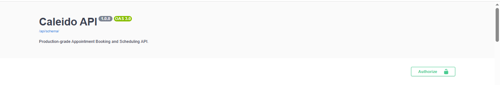
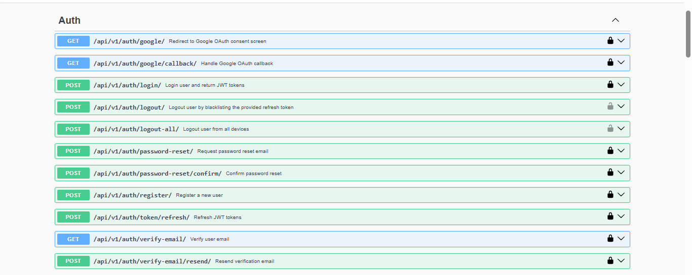
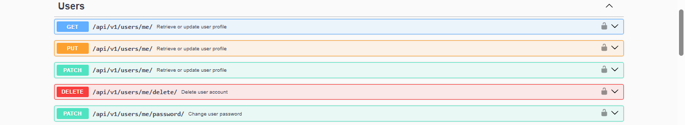
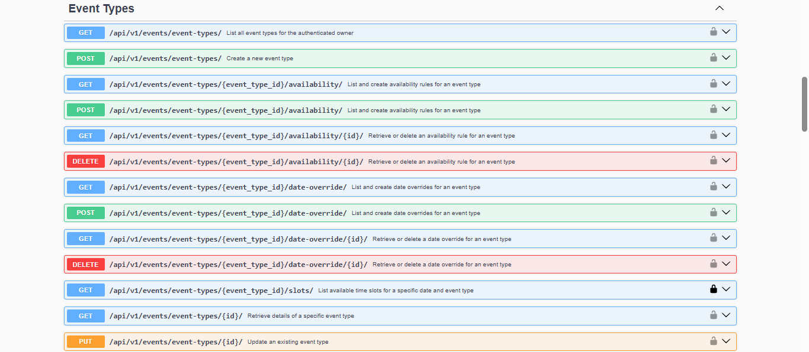
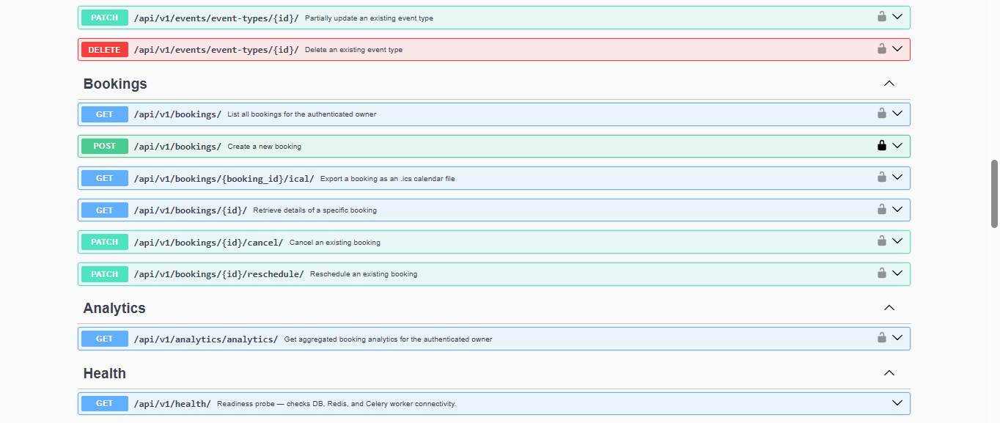
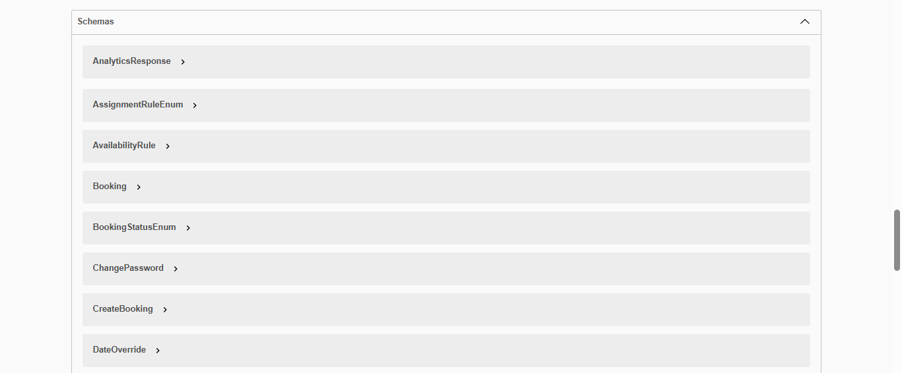
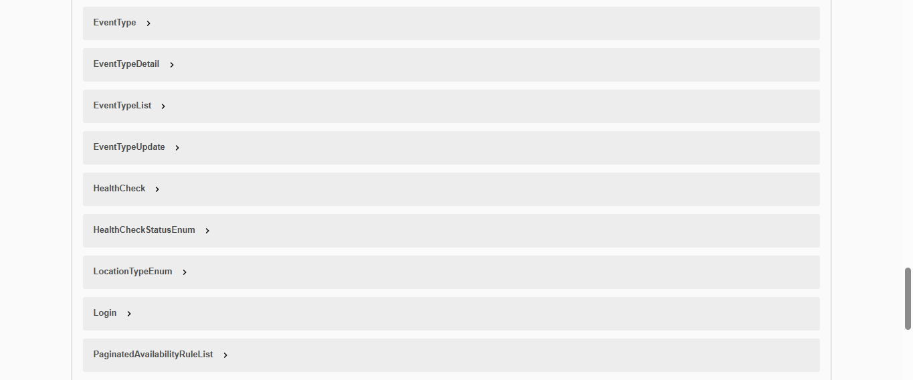
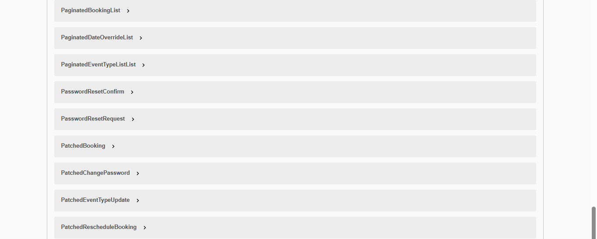
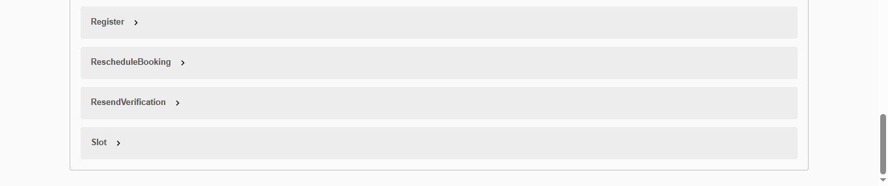
---

## 📸 Architecture

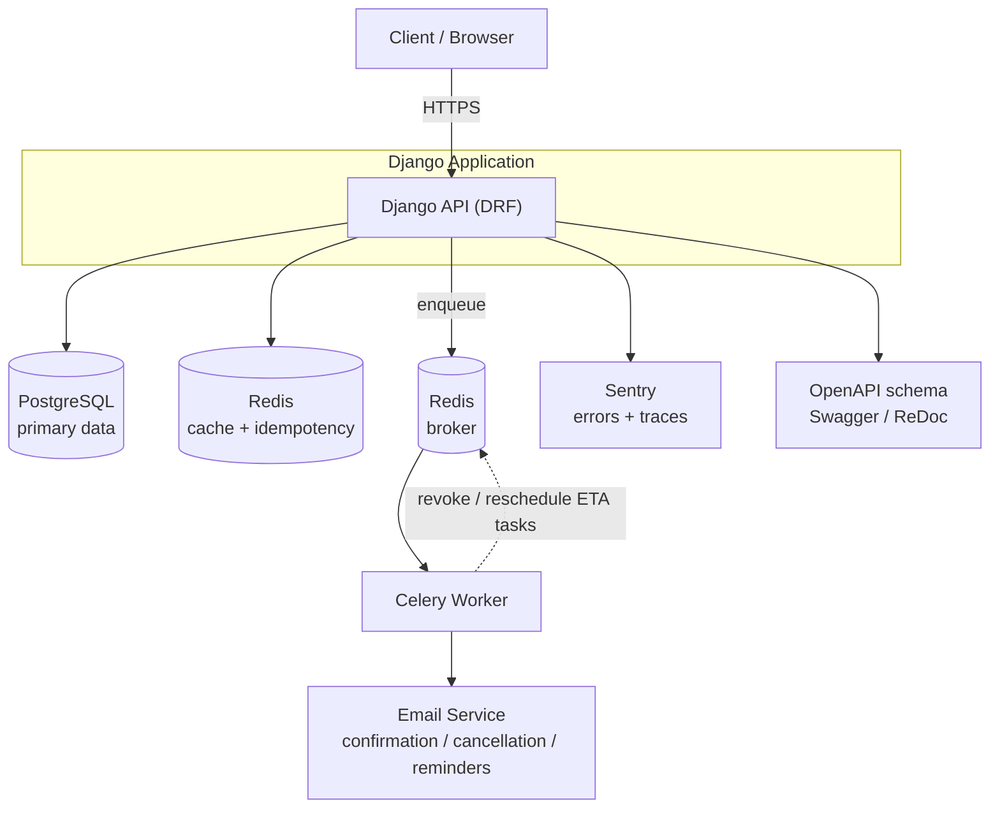

**Booking creation flow:** invitee `POST`s with an `Idempotency-Key` → `BookingService` takes `SELECT FOR UPDATE` on the slot window and checks Redis (DB fallback) for duplicates → on commit, Celery sends confirmation emails and schedules 24h/1h reminders by ETA → a signal invalidates the cached slot list so subsequent lookups reflect the booking immediately. Cancelling or rescheduling later revokes pending reminder tasks and, on reschedule, schedules fresh ones.

---

## ✨ Features

### Authentication
- JWT authentication (access + refresh, rotation, blacklisting)
- Google OAuth login (manual HTTP flow)
- Email verification via signed, expiring links
- Password reset with session/token invalidation on confirm
- Soft delete with PII anonymisation

### Scheduling
- Event type CRUD with per-action serializers and ownership permissions
- Weekly availability rules with overlap validation
- Date-specific overrides (block a day / custom hours for one date)
- Pure-Python, DST-safe slot engine — zero ORM calls, fully unit-testable

### Booking
- Booking creation with `SELECT FOR UPDATE` + idempotency keys to prevent double-booking
- Cancellation via JWT **or** signed one-time token (invitees don't need an account)
- Reschedule with atomic slot release and audit snapshot
- Async confirmation/cancellation/reschedule emails via Celery
- ETA-scheduled reminders (24h / 1h before start), auto-revoked and rescheduled on cancel/reschedule
- iCal (`.ics`) export per booking

### Performance
- Redis-backed slot and analytics caching with signal-based invalidation
- Redis-backed idempotency store with DB fallback
- N+1 elimination via `select_related` / `prefetch_related`, verified with django-silk
- Cursor pagination across all list endpoints

### Reliability
- Liveness and readiness health checks (DB, Redis, Celery)
- Dockerized (multi-stage, non-root) with docker-compose for web/worker/beat/postgres/redis
- GitHub Actions CI: lint → format check → test → coverage gate → Docker build
- Sentry integration with PII scrubbing
- Full OpenAPI 3.1 schema via drf-spectacular, Swagger UI, and ReDoc

---

## 🛠 Tech Stack

**Backend**
| Technology | Why |
|---|---|
| Python 3.13 | Base language |
| Django 5.2 | Mature, batteries-included framework; strong ORM for a relational booking domain |
| Django REST Framework | Serializers, viewsets, and permission classes map cleanly onto a resource-oriented API |
| Simple JWT | Stateless auth with rotation and blacklisting for logout/soft-delete flows |
| Celery | Decouples email sending and reminder scheduling from the request/response cycle |

**Database**
| Technology | Why |
|---|---|
| PostgreSQL | Relational integrity for bookings/availability; `SELECT FOR UPDATE` support for concurrency control |
| Redis | Cache store, Celery broker, and idempotency key store — one service, three roles |
| SQLite | Fast, isolated database for the test suite |

**Infrastructure**
| Technology | Why |
|---|---|
| Docker / docker-compose | Reproducible local environment matching production topology (web, worker, beat, db, redis) |
| Flower | Real-time visibility into Celery task state during development |
| Gunicorn | Production-grade WSGI server behind the Django app |

**Testing**
| Technology | Why |
|---|---|
| pytest / pytest-django | Fast, fixture-driven tests over Django's default test runner |
| Factory Boy | Declarative, composable test data instead of repetitive fixtures |
| django-silk | Query profiling used to verify N+1 fixes during development |
| coverage.py | Enforces an ≥80% coverage gate in CI |

**Monitoring**
| Technology | Why |
|---|---|
| Sentry | Production error visibility with performance traces and PII scrubbing |
| GitHub Actions | Free, tightly integrated CI; gates merges on lint, format, tests, and coverage |
| Health check endpoints | Liveness/readiness signals for DB, Redis, and Celery, ready for uptime monitoring |

**Developer Tools**
| Technology | Why |
|---|---|
| ruff | Fast linting, single tool replacing several older linters |
| black | Deterministic formatting, removes style debate from code review |
| django-environ | Typed, `.env`-driven settings across dev/test/prod |
| drf-spectacular | Generates a correct OpenAPI 3.1 schema straight from serializers/views — no hand-maintained YAML |

---

## 🗄 Database Design

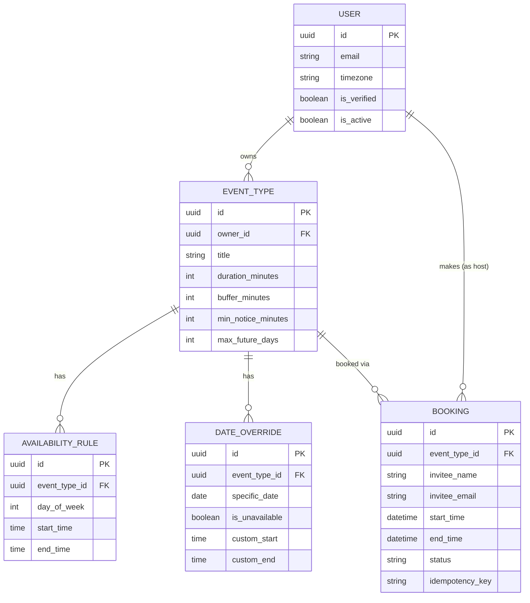

- **User** — custom model, UUID primary key, holds timezone/locale for correct slot rendering
- **EventType** — a bookable "meeting kind" (duration, buffer times, location, min notice, max future window) owned by a User
- **AvailabilityRule** — recurring weekly windows (day-of-week + start/end time) per EventType
- **DateOverride** — one-off exceptions to the weekly rules
- **Booking** — a confirmed/cancelled/rescheduled reservation against an EventType at a specific time window, holding invitee details and an idempotency key

All models inherit an `AbstractBaseModel` (UUID primary key, `created_at`/`updated_at`, sane `Meta.ordering`).

---

## 📁 Project Structure

```config/
├── settings/
│   ├── base.py              # Shared configuration and environment settings
│   ├── development.py       # Development configuration
│   ├── docker.py            # Docker-specific configuration
│   ├── production.py        # Production configuration
│   └── testing.py           # Test configuration
├── celery.py                # Celery application setup
└── urls.py                  # Root URLs, OpenAPI schema and documentation

common/
├── exceptions.py            # Standardized API exception handling
├── models.py                # Abstract base models (UUID, timestamps)
├── pagination.py            # Cursor pagination
├── permissions.py           # Custom DRF permissions
├── serializers.py           # Shared serializer fields and mixins
└── throttles.py             # API rate limiting

apps/
├── users/                   # Authentication and user management
├── events/                  # Event types, availability, and slot generation
├── bookings/                # Booking lifecycle and scheduling
├── analytics/               # Booking analytics and reporting
├── health/                  # Health and readiness endpoints
├── teams/                   # Team scheduling *(planned)*
└── payments/                # Payment integration *(planned)*

requirements/
├── base.txt                 # Shared dependencies
├── development.txt          # Development tools
└── production.txt           # Production dependencies

.github/
└── workflows/
    └── ci.yml               # CI pipeline

docker-compose.yml           # Docker services
Dockerfile                   # Application image
entrypoint.sh                # Container startup script
```

Each Django app follows the same internal shape where relevant: `models.py`, `serializers.py`, `views.py`, `services.py` (business logic, kept out of views), `signals.py` (cache invalidation), and `tests/` (never the Django-default `tests.py`, to avoid pytest discovery gaps).

---

## 📚 API Documentation

Interactive docs are generated straight from the codebase — nothing hand-written to go stale:

- **Swagger UI:** `GET /api/docs/`
- **ReDoc:** `GET /api/redoc/`
- **Raw schema (OpenAPI 3.1):** `GET /api/schema/`

Full endpoint list:

```
# Auth
POST   /api/v1/auth/register/
POST   /api/v1/auth/login/
POST   /api/v1/auth/token/refresh/
POST   /api/v1/auth/logout/
POST   /api/v1/auth/logout-all/
GET    /api/v1/auth/verify-email/?token=
POST   /api/v1/auth/verify-email/resend/
POST   /api/v1/auth/password-reset/
POST   /api/v1/auth/password-reset/confirm/
GET    /api/v1/auth/google/
GET    /api/v1/auth/google/callback/

# Users
GET    /api/v1/users/me/
PATCH  /api/v1/users/me/
PATCH  /api/v1/users/me/password/
DELETE /api/v1/users/me/

# Events
GET/POST         /api/v1/event-types/
GET/PATCH/DELETE /api/v1/event-types/{id}/
GET/POST         /api/v1/event-types/{id}/availability/
GET/DELETE       /api/v1/event-types/{id}/availability/{pk}/
GET/POST         /api/v1/event-types/{id}/date-override/
GET/DELETE       /api/v1/event-types/{id}/date-override/{pk}/
GET              /api/v1/event-types/{id}/slots/?date=YYYY-MM-DD&timezone=Africa/Lagos

# Bookings
POST   /api/v1/bookings/                 — public (AllowAny)
GET    /api/v1/bookings/                 — authenticated, paginated
GET    /api/v1/bookings/{id}/            — authenticated
PATCH  /api/v1/bookings/{id}/cancel/
PATCH  /api/v1/bookings/{id}/reschedule/
GET    /api/v1/bookings/{id}/ical/

# Analytics
GET    /api/v1/analytics/analytics/?period=

# Health
GET    /health/
GET    /health/ready/
```

---

## 🧪 Testing

```bash
pytest
pytest --cov --cov-report=term-missing
```

- **182+ tests** across auth, event/availability/override CRUD, slot generation (including DST edge cases), booking concurrency, idempotency, cancellation/reschedule, pagination, caching, and iCal export
- Concurrency tested with real threading — two simultaneous booking attempts against the same slot → one `201`, one `409`
- Coverage gate enforced at **≥80%** in CI

---

## 🚀 CI/CD

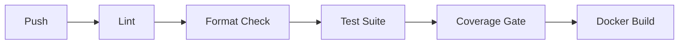

Any failing stage blocks the merge — the pipeline has caught real regressions during development, including missing serializer modules and formatting drift.

---

## ⚖ Design Decisions

- **UUID primary keys everywhere** — avoids leaking sequential IDs (booking counts, growth rate) through the API, and makes IDs safe to expose in signed cancel/reschedule links
- **JWT over session auth** — the API serves a decoupled frontend and, eventually, third-party integrations; stateless tokens avoid sticky-session concerns
- **Pure-Python slot engine with zero ORM calls** — slot generation (rules + overrides + existing bookings → available windows) is trivially unit-testable against fixed inputs, including DST transitions, without touching the database
- **`SELECT FOR UPDATE` + idempotency keys for booking creation** — the correctness-critical section (two people racing for the same slot) is protected at the database level, not just in application code
- **Soft delete over hard delete** — accounts are anonymised and deactivated rather than removed, preserving referential integrity for historical bookings
- **Redis idempotency store with DB fallback** — fast path in Redis (24h TTL) with a database check as a safety net, rather than a single point of failure for a correctness guarantee
- **Cursor pagination over offset pagination** — offset pagination breaks under concurrent writes (skipped/duplicated rows as bookings are created); cursor pagination on `created_at` stays stable
- **Polling-based slot refresh instead of WebSockets** — simpler to build and reason about; acceptable because a 60-second cache window doesn't meaningfully hurt UX given how rare slot contention is
- **Manual Google OAuth flow instead of `django-allauth`** — more code to write, but avoids a large, opinionated dependency for what is currently a single provider

---

## 🔐 Security

- JWT access/refresh with rotation and blacklisting on logout and password reset
- Passwords hashed via Django's PBKDF2 hasher; custom validators enforce uppercase + digit
- Signed, time-limited tokens (`django.core.signing`) for email verification, password reset, and invitee cancel/reschedule links
- Rate limiting: `AnonRateThrottle` (10/min), `UserRateThrottle` (100/min); resend-verification cooldown via cache
- CORS restricted to configured origins; no user enumeration on password reset/resend-verification
- Django's built-in CSRF, SQL injection, and XSS protections via the ORM and templating layer
- `SECURE_*` settings (HSTS, secure cookies, etc.) enabled in production

---

## ⚡ Performance

- `select_related` / `prefetch_related` eliminate N+1 queries — verified with django-silk
- Redis caching of slot lists (60s TTL) and analytics aggregations (5min TTL), invalidated via signals on write
- Cursor pagination on all list endpoints — constant query cost regardless of offset
- `Cache-Control: public, max-age=60` on slot responses so intermediate caches/CDNs can help too
- Idempotency checks hit Redis first, falling back to a DB query only when necessary

---

## 📈 Scaling Considerations

- **Single-provider OAuth (Google only)** — additional providers (Apple, Microsoft) would follow the same manual-flow pattern
- **No multi-tenancy yet** — one owner per event type; team/agency scheduling would need a tenancy layer above the current models
- **No recurring bookings** — each booking is a single occurrence today; recurrence would extend the slot engine rather than replace it
- **Payments not wired in** — Stripe was scoped but not implemented in this phase
- **Reminder durability** — ETA-scheduled Celery tasks assume the broker retains scheduled tasks across restarts; not yet tested against a Redis eviction/failure scenario, and a next iteration would add a periodic reconciliation job

---

## 🔮 Future Improvements

- OAuth for additional providers (Apple, Microsoft)
- Recurring event types and bookings
- Team scheduling (round-robin / collective assignment across multiple hosts)
- Stripe integration for paid event types
- WebSocket-based live slot updates instead of polling
- Multi-tenancy for agencies managing multiple hosts
- An analytics dashboard (currently API-only)
- Prometheus/Grafana metrics alongside existing Sentry error tracking

---

## 💡 Lessons Learned

Building Caleido reinforced several production engineering principles:

- Correctness under concurrency is harder than CRUD.
- Cache invalidation deserves deliberate design.
- API documentation should evolve with implementation.
- CI catches regressions earlier than manual testing.

## License

MIT — see [LICENSE](./LICENSE) for details.

## Contact

**Author:** Harbdulmarleyk03 · [github.com/Harbdulmarleyk03](https://github.com/Harbdulmarleyk03)
**Linkedln:** Abdulmalik Adebayo . https://www.linkedin.com/in/abdulmalik-adebayo-54a55323a/

Feel free to open an issue or reach out with questions about the design decisions above.
